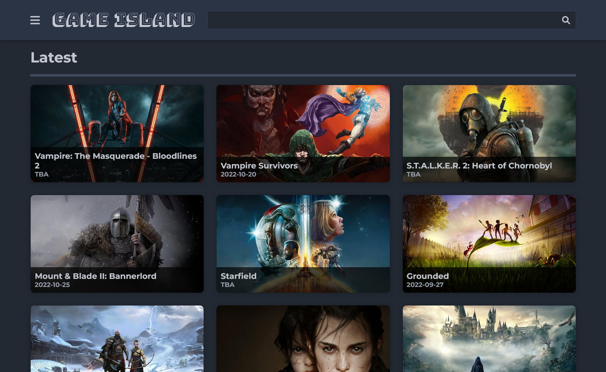

# Game Island

Check out the [**Live Site**](https://montee-diego.github.io/game-island/)!

## Screenshot

## Objective

My first project built using react on Vite. The objective of this site is to learn how to build
using react with different libraries and putting it all together in an organized code base that is
easy to understand and update when necessary.

## Technical Overview

- Built on React (Vite)
- Uses Redux to store API results, although it is not necessary for such a simple use case, I wanted
  to understand it and learn how to implement it
- RTK Query for all API requests
- Styled Components for CSS (uses ThemeContext for easy theming, this would allow easy dark and
  light theme implementation in the future)
- Framer motion for animations

## Compatibility

- Tested on desktop: Firefox, Chrome and Edge
- Tested on mobile: Firefox, Chrome

## Comments

Everything is structured in folders, easy to read and to follow the code. All the styled components
are in a `*.styled.jsx` file and then everything is imported using `import * as Styled`, I think
this is a good way to differentiate between components and styled components (`<Component>` vs
`<Styled.Component>`).

Vite is configured to resolve certain aliases to import components (or anything really) using
`@`, for example `@components`. This makes it easier to refactor or move files and not having to
update all the imports relative paths.
